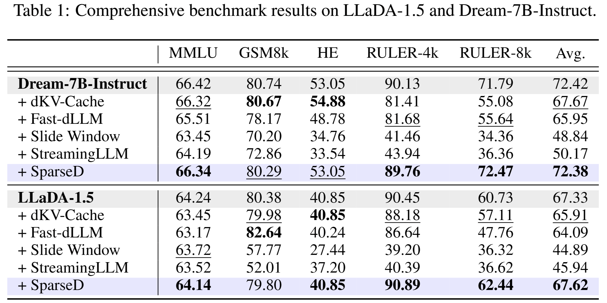
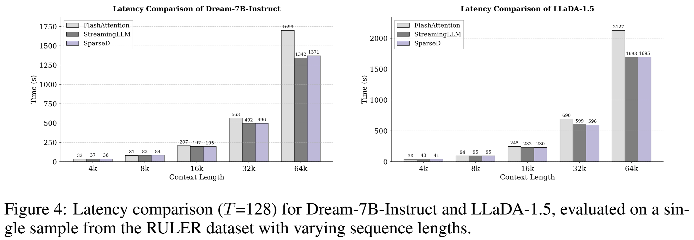

# SparseD: Sparse Attention for Diffusion Language Models
<div align="center">
  </img>
  <br>
  <em>
      The overview of SparseD
  </em>
</div>
<br>

> **SparseD: Sparse Attention for Diffusion Language Models**   🥯[[Arxiv]]()   
> [Zeqing Wang](https://github.com/INV-WZQ), [Gongfan Fang](https://fangggf.github.io/), [Xinyin Ma](https://horseee.github.io/), [Xingyi Yang](https://adamdad.github.io/), [Xinchao Wang](https://sites.google.com/site/sitexinchaowang/)   
> [xML Lab](https://sites.google.com/view/xml-nus), National University of Singapore

## TL;DR (Too Long; Didn't Read)
**SparseD** is an innovative sparse attention method for diffusion language models (DLMs), delivering near **lossless acceleration** in performance.

## Demo


## Setup
```bash
conda create -n SparseD python=3.10
conda activate SparseD
pip install -r requirements.txt
```

## Usage

```bash
# For Dream Model
python dream_generation.py --origin   
python dream_generation.py --skip 0.2 --select 0.3 --block_size 128 --prompt 4k
python dream_generation.py --skip 0.2 --select 0.5 --block_size 32 --prompt short_context

# For LLaDA Model
python llada_generation.py --origin 
python llada_generation.py --skip 0.2 --select 0.3 --block_size 128 --prompt 4k
python llada_generation.py --skip 0.2 --select 0.5 --block_size 32 --prompt short_context
```

Arguments:
- `--model_path`: The model path, e.g., Dream-org/Dream-v0-Instruct-7B and GSAI-ML/LLaDA-1.5 .
- `--seq_len`, `--steps`, `--block_length`, `--sampling-alg`: The inference configuration for diffusion generation. `block_length` refers specifically to the LLaDA model.
- `--origin`: Inference by original model.
- `--skip`, `--select`, `--block_size`: The inference configuration for SparseD. `skip` denotes the ratio of full attention applied to the earlier steps across all denoising steps, `select` denotes the selection ratio for sparse attention, and `block_size` specifies the block size used when selecting important query-key pairs.
- `--prompt`: Choose prompt for simple test, including `["short_context", "4k", "8k", "16k", "32k", "64k"]` length versions.

## Results
### 1. Accuracy 
<div align="center">

</div>

### 2. Latency
<div align="center">

</div>

## Note 
- Since our sparse attention is implemented by FlexAttention, we recommend conducting a warm-up inference first, as subsequent inferences will perform better in terms of speed.

- To better demonstrate the acceleration achieved by SparseD, we recommend evaluating it with long-context prompts, such as those with lengths of 16k, 32k, and 64k. We also provide short context for simple evaluation.


## Acknowledgments
Our sparse attention is accelerated by [FlexAttention](https://arxiv.org/abs/2412.05496), and implemented on [Dream](https://github.com/DreamLM/Dream) and [LLaDA](https://github.com/ML-GSAI/LLaDA). We extend our gratitude to the community for their valuable contributions!
