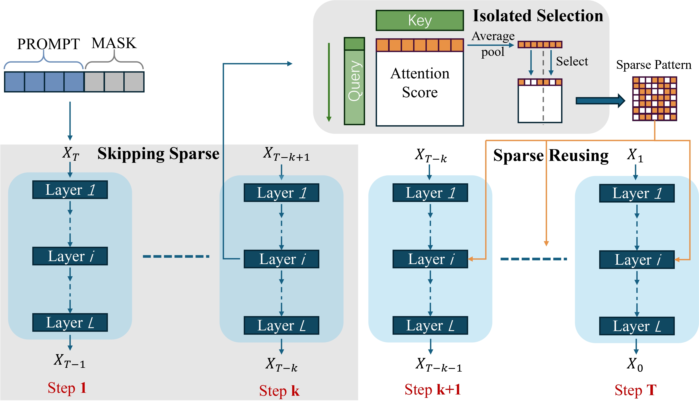

# SparseD: Sparse Attention for Diffusion Language Models
<div align="center">
  </img>
  <br>
  <em>
      The overview of SparseD
  </em>
</div>
<br>

## 📚 TL;DR (Too Long; Didn't Read)
**SparseD** is a novel sparse attention method for diffusion language models (DLMs). At a high level, SparseD re-computes sparse attention patterns once for each head and reuses them across diffusion steps. Additionally, SparseD applies full attention in the early steps and skips sparse attention to preserve generation quality.

## 🛠️ Setup
```bash
conda create -n SparseD python=3.10
conda activate SparseD
pip install -r requirements.txt
```

## 🚀 Usage

### For Dream model
```bash
# original Version
python dream_generate.py --origin   

# SparseD
python dream_generate.py ---skip 0.2 --select 0.3 --block_size 128 --prompt 4k
python dream_generate.py ---skip 0.2 --select 0.5 --block_size 32 --prompt short_context
```

Arguments for `dream_generate.py`:
- `--model_path`: The model path, e.g., Dream-org/Dream-v0-Instruct-7B
- `--seq_len`, `--steps`, `--sampling-alg`: The inference configuration for diffusion generation
- `--origin`: Inference by original model
- `--skip`, `--select`, `--block_size`: The inference configuration for SparseD. `skip` denotes the ratio of full attention applied across all denoising steps, `select` denotes the selection ratio for sparse attention, and `block_size` specifies the block size used when selecting important query-key pairs
- `--prompt`: Choose prompt for simple test, including ["short_context", "4k", "8k", "16k", "32k", "64k"] length versions

### For LLaDA model
```bash
# original Version
python llada_generate.py --origin   

# SparseD
python llada_generate.py ---skip 0.2 --select 0.3 --block_size 128 --prompt 4k
python llada_generate.py ---skip 0.2 --select 0.5 --block_size 32 --prompt short_context
```

Arguments for `llada_generate.py`:
- `--model_path`: The model path, e.g., GSAI-ML/LLaDA-1.5
- `--seq_len`, `--steps`, `--block_length`, `--sampling-alg`: The inference configuration for diffusion generation
- `--origin`: Inference by original model
- `--skip`, `--select`, `--block_size`: The inference configuration for SparseD. `skip` denotes the ratio of full attention applied across all denoising steps, `select` denotes the selection ratio for sparse attention, and `block_size` specifies the block size used when selecting important query-key pairs
- `--prompt`: Choose prompt for simple test, including ["short_context", "4k", "8k", "16k", "32k", "64k"] length versions

## ☀️ Note 
- Since our sparse attention is implemented by FlexAttention, we recommend conducting a warm-up inference first, as subsequent inferences will perform better in terms of speed.

- To better demonstrate the acceleration achieved by SparseD, we recommend evaluating it with long-context prompts, such as those with lengths of 16k, 32k, and 64k. We also provide short context for simple evaluation.
